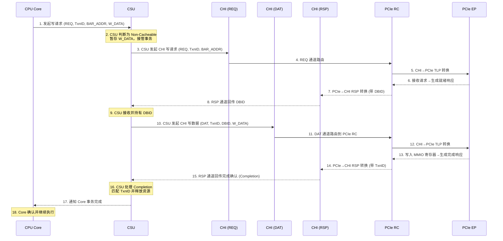
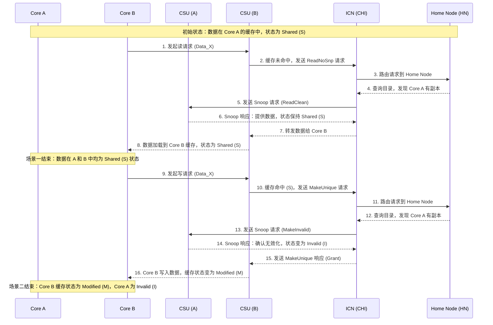
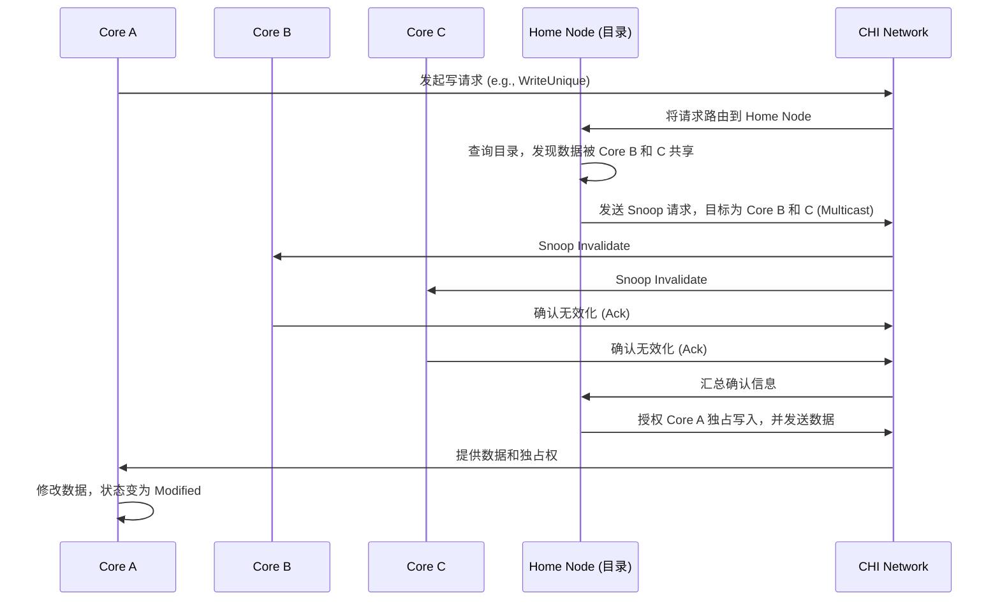

# 目的

本文主要作为自己的一个总结，用于记录一些arm64 cache和总线相关的知识。
 
## CHI

协议层，Coherent Hub Interface，一种缓存一致性协议。
功能：维护系统的缓存一致性，在多个组件（如处理器、缓存、内存控制器等）之间传输数据，确保数据操作的顺序一致性。

CHI 协议通常定义了请求（REQ）、数据（DAT）和响应（RSP）三大通道，实现极致并发+高带宽+不阻塞。

* 请求通道（REQ）：声明我要干什么，操作类型+地址+事务ID(TxnID)。用于发送读 / 写请求、缓存维护请求和DVM请求等，是发起数据操作的起始通道。例如，CPU 需要从内存读取数据时，就会通过 REQ 通道发送相应的读请求。
* 数据通道（DAT）：真正的数据搬运，会带上DBID。包括写数据通道（WDAT）和读数据通道（RDAT）。WDAT 用于传输写数据、原子数据、监听数据和转发数据等；RDAT 用于接收读数据和原子数据等，负责实际数据的传输。
* 响应通道（RSP）：状态与完成。包括发送响应通道（SRSP）和接收响应通道（CRSP）。SRSP 用于发送监听响应和完成确认等；CRSP 用于接收来自完成者（Completer）的响应，用于反馈请求的处理结果，确保数据操作的完整性和一致性。

以core写pcie设备bar空间mmio寄存器为例：

多core之间访问同一个数据时为例：

## CMN

架构层，Coherent mesh network，是arm定义的一个互联硬件架构，包括home node, snoop filter node, router等概念，负载消息路由、缓存目录维护和一致性控制等。

### CCI & CCN & CMN

		+----------------+--------------------------------+----------------+----------------------+----------------+------------------------+----------------+------------------------+----------------+------------------------+
		| IP 系列        | 全称                           | 发布时间       | 拓扑结构             | 协议           | Snooping 机制          | 核心数支持     | 典型应用               | 功耗           | 演进关系               |
		+================+================================+================+======================+================+========================+================+========================+================+========================+
		| CMN            | Coherent Mesh Network          | 2016-至今      | 网状（Mesh）         | AMBA5 CHI      | 组播（目录驱动）       | 64-256+核      | 数据中心、HPC、边缘计算| 高（高性能）   | 新一代，取代 CCN       |
		+----------------+--------------------------------+----------------+----------------------+----------------+------------------------+----------------+------------------------+----------------+------------------------+
		| CCI            | Cache Coherent Interconnect    | 2011-2015      | 环形总线（Ring Bus） | AMBA4 ACE      | 广播（Snoop Filter优化）| 8-24核        | 手机、平板、嵌入式设备 | 低（移动优化） | 早期技术，逐渐淘汰     |
		+----------------+--------------------------------+----------------+----------------------+----------------+------------------------+----------------+------------------------+----------------+------------------------+
		| CCN            | Cache Coherent Network         | 2012-2014      | 分布式架构           | AMBA4 ACE扩展  | 混合（部分组播+广播兜底）| 16-48核      | 早期服务器、网络设备   | 中等（平衡）   | 过渡方案，被 CMN 取代  |
		+----------------+--------------------------------+----------------+----------------------+----------------+------------------------+----------------+------------------------+----------------+------------------------+

在CCN和CMN中引入了Directory-based coherence目录缓存机制，用一个目录来记录每一块内存数据的缓存状态，从而实现精准的通信，而避免了全局广播snoop。

1. 目录（Directory）的角色

位置：在 CMN 中，目录信息通常分布式地存储在 Home Node 中。每个 Home Node 负责管理一个特定地址范围的内存块。
内容：对于它管理的每一个缓存行（Cache Line），目录会记录一个状态，这个状态至少包含：

	状态位：例如，该缓存行是 Exclusive（独占）、Shared（共享） 还是 Modified（已修改）。
	共享者列表（Sharers List）：如果状态是 Shared，这个列表会精确地指出哪些核心（或缓存）当前持有该缓存行的副本。

2. 工作流程（以 CMN 为例）
假设核心 A 想要修改一个被核心 B 和 C 共享的数据块：

## CSU

实现层。
Cache System Unit，缓存系统单元。
功能：管理缓存，包括缓存的命中检测、数据访问、缺失处理，以及根据缓存策略进行数据更新和替换。

## snoop filter & DMT & DCT

为了避免多core时，snoop广播到所有的核，便引入了snoop filter, 或者snoop control unit(SCU)，也有的叫 Directory Memory Table（目录内存表）或 Directory Cache Table（目录缓存表）。

* DCT：芯片上，cache化的目录，访问块，一般arm64 芯片都使用DCT，但是不同厂商的叫法不一样。
* DMT：存在片上SRAM上或者DRAM上的目录，访问速度慢，但容量大。

# 参考

* [Arm Neoverse N2 reference design Technical Overview](https://developer.arm.com/documentation/102337/0000/Software-stack/About-the-software?lang=en)
