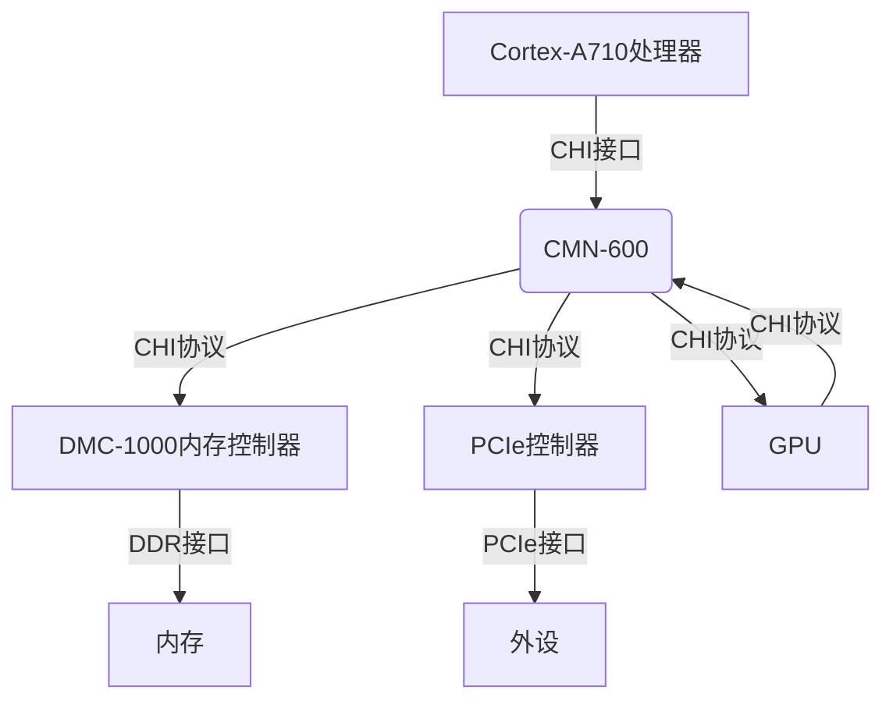
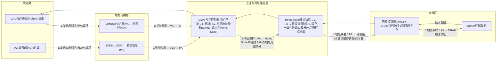
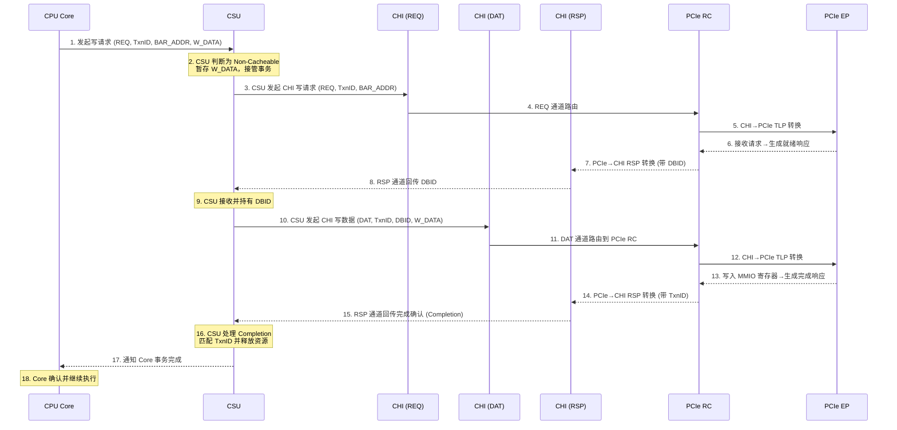
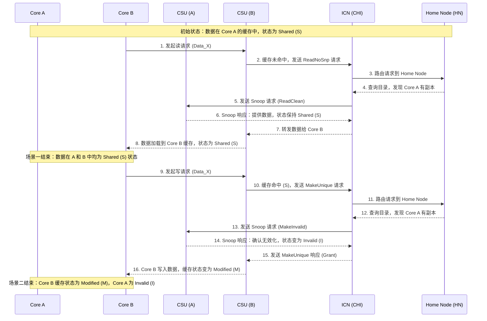
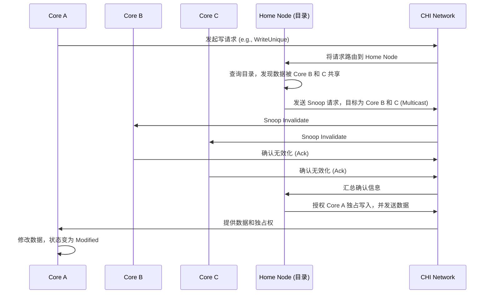

# 目的

本文主要作为自己的一个总结，用于记录一些arm64 cache和总线相关的知识，主要围绕read/write，以及衍生出来的write combine/merge等。

# SoC概览

通常一颗arm64 SoC使用的IP如下：

片上地址翻译流程基本如下：

# CHI展开

## CHI

协议层，Coherent Hub Interface，一种缓存一致性协议。
功能：维护系统的缓存一致性，在多个组件（如处理器、缓存、内存控制器等）之间传输数据，确保数据操作的顺序一致性。

CHI 协议通常定义了请求（REQ）、数据（DAT）和响应（RSP）三大通道，实现极致并发+高带宽+不阻塞。

* 请求通道（REQ）：声明我要干什么，操作类型+地址+事务ID(TxnID)。用于发送读 / 写请求、缓存维护请求和DVM请求等，是发起数据操作的起始通道。例如，CPU 需要从内存读取数据时，就会通过 REQ 通道发送相应的读请求。
* 数据通道（DAT）：真正的数据搬运，会带上DBID。包括写数据通道（WDAT）和读数据通道（RDAT）。WDAT 用于传输写数据、原子数据、监听数据和转发数据等；RDAT 用于接收读数据和原子数据等，负责实际数据的传输。
* 响应通道（RSP）：状态与完成。包括发送响应通道（SRSP）和接收响应通道（CRSP）。SRSP 用于发送监听响应和完成确认等；CRSP 用于接收来自完成者（Completer）的响应，用于反馈请求的处理结果，确保数据操作的完整性和一致性。

以core写pcie设备bar空间mmio寄存器为例：

多core之间访问同一个数据时为例：

## CMN

CHI协议片上网络实现层，Coherent mesh network，是arm定义的一个互联硬件架构，包括home node, snoop filter node, router等概念，负载消息路由、缓存目录维护和一致性控制等。

### CCI & CCN & CMN的演进

			+----------------+--------------------------------+----------------+----------------------+----------------+------------------------+----------------+------------------------+----------------+------------------------+
			| IP 系列        | 全称                           | 发布时间       | 拓扑结构             | 协议           | Snooping 机制          | 核心数支持     | 典型应用               | 功耗           | 演进关系               |
			+================+================================+================+======================+================+========================+================+========================+================+========================+
			| CMN            | Coherent Mesh Network          | 2016-至今      | 网状（Mesh）         | AMBA5 CHI      | 组播（目录驱动）       | 64-256+核      | 数据中心、HPC、边缘计算| 高（高性能）   | 新一代，取代 CCN       |
			+----------------+--------------------------------+----------------+----------------------+----------------+------------------------+----------------+------------------------+----------------+------------------------+
			| CCI            | Cache Coherent Interconnect    | 2011-2015      | 环形总线（Ring Bus） | AMBA4 ACE      | 广播（Snoop Filter优化）| 8-24核        | 手机、平板、嵌入式设备 | 低（移动优化） | 早期技术，逐渐淘汰     |
			+----------------+--------------------------------+----------------+----------------------+----------------+------------------------+----------------+------------------------+----------------+------------------------+
			| CCN            | Cache Coherent Network         | 2012-2014      | 分布式架构           | AMBA4 ACE扩展  | 混合（部分组播+广播兜底）| 16-48核      | 早期服务器、网络设备   | 中等（平衡）   | 过渡方案，被 CMN 取代  |
			+----------------+--------------------------------+----------------+----------------------+----------------+------------------------+----------------+------------------------+----------------+------------------------+

在CCN和CMN中引入了Directory-based coherence目录缓存机制，用一个目录来记录每一块内存数据的缓存状态，从而实现精准的通信，而避免了全局广播snoop。

1. 目录（Directory）的角色

位置：在 CMN 中，目录信息通常分布式地存储在 Home Node 中。每个 Home Node 负责管理一个特定地址范围的内存块。
内容：对于它管理的每一个缓存行（Cache Line），目录会记录一个状态，这个状态至少包含：

	状态位：例如，该缓存行是 Exclusive（独占）、Shared（共享） 还是 Modified（已修改）。
	共享者列表（Sharers List）：如果状态是 Shared，这个列表会精确地指出哪些核心（或缓存）当前持有该缓存行的副本。

2. 工作流程（以 CMN 为例）
假设核心 A 想要修改一个被核心 B 和 C 共享的数据块：

## CSU

Cache System Unit，缓存系统单元，并不是arm的名字。实现层，核内实现CHI协议的功能单元，分布在
功能：管理缓存，包括缓存的命中检测、数据访问、缺失处理，以及根据缓存策略进行数据更新和替换。

## 内存属性和CHI的关系

# ARM64 内存属性对照表

		+----------------+-----------------------+-----------------------------------------------+----------+-------------------+--------------------+----------+-------------------------+------------------------+--------------------+---------------------------------------+---------------------------------------+---------------------------------------+---------------------------------------+
		| 内存大类       | 子类型                | 全称（英文）                                  | 缓存支持 | 聚合（Gathering） | 重排（Reordering） | 推测执行 | 写合并（Write Combine） | 访问粒度               | 地址对齐要求       | 总线事务类型                          | 软件配置方式（Linux）          | 典型应用场景                          | 备注                                  |
		+----------------+-----------------------+-----------------------------------------------+----------+-------------------+--------------------+----------+-------------------------+------------------------+--------------------+---------------------------------------+---------------------------------------+---------------------------------------+---------------------------------------+
		| Normal（常规内存） | Normal WB             | Write-Back, Cacheable                         | 是       | 是（Cacheline内）  | 是                  | 是       | 否                      | 强制64字节（Cacheline） | 无（硬件自动对齐）  | WriteBack、Read、ReadUnique           | kmalloc()、默认页映射          | DRAM数据段、代码段、堆/栈            | 写先更缓存，替换时写回内存        |
		+----------------+-----------------------+-----------------------------------------------+----------+-------------------+--------------------+----------+-------------------------+------------------------+--------------------+---------------------------------------+---------------------------------------+---------------------------------------+---------------------------------------+
		|                | Normal WT             | Write-Through, Cacheable                      | 是       | 是（Cacheline内）  | 是                  | 是       | 否                      | 强制64字节（Cacheline） | 无（硬件自动对齐）  | WriteThrough、Read                     | ioremap_cache()（需配MAIR） | 高频读、低频写共享数据（配置表）      | 写同时更新缓存和内存              |
		+----------------+-----------------------+-----------------------------------------------+----------+-------------------+--------------------+----------+-------------------------+------------------------+--------------------+---------------------------------------+---------------------------------------+---------------------------------------+---------------------------------------+
		|                | Normal NC             | Non-Cacheable                                 | 否       | 是（需对齐）       | 是                  | 是       | 是（需64字节对齐）      | 实际数据长度（可合并）  | 64字节（合并时）    | WriteNonCacheable、Burst Read         | ioremap_wc()、memremap_wc()  | PCIe显存、帧缓冲区、DMA非一致性缓冲区 | 合并小粒度写为64字节Burst         |
		+----------------+-----------------------+-----------------------------------------------+----------+-------------------+--------------------+----------+-------------------------+------------------------+--------------------+---------------------------------------+---------------------------------------+---------------------------------------+---------------------------------------+
		| Device（设备内存） | Device_nGnRE          | Non-Gathering, Non-Reordering, Early Ack      | 否       | 否                 | 否                  | 否       | 否                      | 实际数据长度（不可合并）  | 无（硬件自动拆分）  | WriteNonCacheable、Single Read        | ioremap()、pci_iomap()        | 外设控制寄存器、时序敏感设备（中断控制器） | 严格按程序顺序，确保原子性        |
		+----------------+-----------------------+-----------------------------------------------+----------+-------------------+--------------------+----------+-------------------------+------------------------+--------------------+---------------------------------------+---------------------------------------+---------------------------------------+---------------------------------------+
		|                | Device_nGnRnE         | Non-Gathering, Non-Reordering, No Early Ack   | 否       | 否                 | 否                  | 否       | 否                      | 实际数据长度（不可合并）  | 无（硬件自动拆分）  | WriteNonCacheable（需Comp确认）        | 设备树：cache-type="none"     | 存储类设备（NAND Flash）、需写确认寄存器 | 写完成确认来自设备，无中间ack        |
		+----------------+-----------------------+-----------------------------------------------+----------+-------------------+--------------------+----------+-------------------------+------------------------+--------------------+---------------------------------------+---------------------------------------+---------------------------------------+---------------------------------------+
		|                | Device_GRE            | Gathering, Reordering, Early Ack              | 否       | 是（需对齐）       | 是                  | 否       | 是（需64字节对齐）      | 实际数据长度（可合并）  | 64字节（合并时）    | WriteNonCacheable、Burst Write        | 设备树：gathering="true"     | FIFO设备、DMA一致性缓冲区、批量传输    | 允许合并重排，对顺序不敏感          |
		+----------------+-----------------------+-----------------------------------------------+----------+-------------------+--------------------+----------+-------------------------+------------------------+--------------------+---------------------------------------+---------------------------------------+---------------------------------------+---------------------------------------+
		|                | Device_GnRE           | Gathering, Non-Reordering, Early Ack          | 否       | 是（需对齐）       | 否                  | 否       | 是（需64字节对齐）      | 实际数据长度（可合并）  | 64字节（合并时）    | WriteNonCacheable、Burst Write        | 自定义MAIR配置                      | 需合并但严格顺序的设备（流式DMA）    | 允许聚合，禁止重排                    |
		+----------------+-----------------------+-----------------------------------------------+----------+-------------------+--------------------+----------+-------------------------+------------------------+--------------------+---------------------------------------+---------------------------------------+---------------------------------------+---------------------------------------+

## 关键字段说明

1. **聚合（Gathering）**：是否允许将多个小粒度访问合并为单个总线事务（仅影响写操作）
2. **重排（Reordering）**：是否允许总线乱序执行访问请求（Normal内存默认允许，Device内存默认禁止）
3. **推测执行**：CPU是否允许对该内存区域进行推测性访问（Device内存禁止，避免破坏外设状态）
4. **写合并**：仅特定子类型支持，需满足64字节地址对齐，否则自动拆分事务
5. **访问粒度**：
- 「强制64字节」：无论实际访问长度，总线均按Cacheline粒度传输（仅Normal WB/WT）
- 「实际数据长度」：按代码中指定的长度传输，支持合并时可转为64字节Burst
6. **总线事务类型**：
- Burst：多拍传输（如64字节Burst对应8拍64位数据）
- Single：单拍传输（如4字节写对应1拍32位数据）

## 核心规则总结

1. **缓存行为由「内存大类」决定**：Normal支持缓存，Device禁止缓存
2. **写合并的两个条件**：
- 内存属性允许（Normal NC、Device_GRE/GnRE）
- 访问地址64字节对齐，且在同一Cacheline内
3. **Cacheline粒度仅适用于「可缓存的Normal内存」**（WB/WT），其他属性均按实际数据长度访问
4. **Device内存的顺序约束**：`nGnRE/nGnRnE`严格按程序顺序，`GRE/GnRE`可合并/重排（需软件保证逻辑顺序）
5. **软件配置优先级**：设备树配置 > 内核API映射 > MAIR_ELx寄存器默认值

# 参考

* [Arm Neoverse N2 reference design Technical Overview](https://developer.arm.com/documentation/102337/0000/Software-stack/About-the-software?lang=en)
