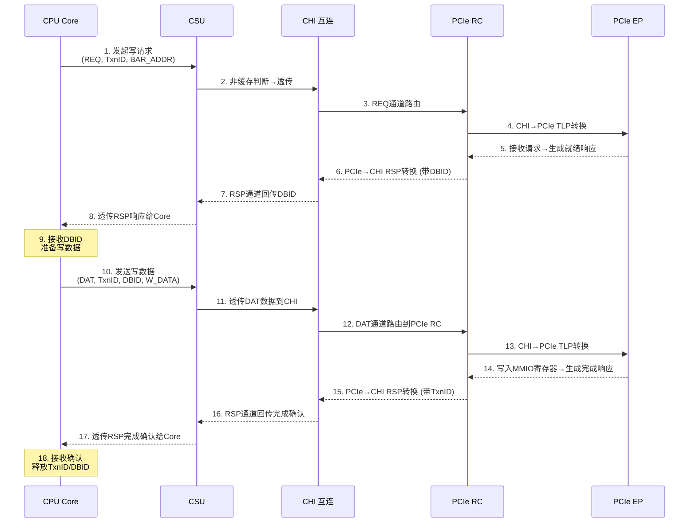

# 目的

本文主要作为自己的一个总结，用于记录一些arm64 cache和总线相关的知识。
 
## CSU

Cache System Unit，缓存系统单元。
功能：管理缓存，包括缓存的命中检测、数据访问、缺失处理，以及根据缓存策略进行数据更新和替换。

## CHI

Coherent Hub Interface，一种协议接口
功能：维护系统的缓存一致性，在多个组件（如处理器、缓存、内存控制器等）之间传输数据，确保数据操作的顺序一致性。

CHI 协议通常定义了请求（REQ）、数据（DAT）和响应（RSP）三大通道，实现极致并发+高带宽+不阻塞。

* 请求通道（REQ）：声明我要干什么，操作类型+地址+事务ID(TxnID)，注意REQ不带真正的数据。用于发送读 / 写请求、缓存维护请求和DVM请求等，是发起数据操作的起始通道。例如，CPU 需要从内存读取数据时，就会通过 REQ 通道发送相应的读请求。
* 数据通道（DAT）：真正的数据搬运，会带上DBID。包括写数据通道（WDAT）和读数据通道（RDAT）。WDAT 用于传输写数据、原子数据、监听数据和转发数据等；RDAT 用于接收读数据和原子数据等，负责实际数据的传输。
* 响应通道（RSP）：状态与完成。包括发送响应通道（SRSP）和接收响应通道（CRSP）。SRSP 用于发送监听响应和完成确认等；CRSP 用于接收来自完成者（Completer）的响应，用于反馈请求的处理结果，确保数据操作的完整性和一致性。

# 参考

* [Arm Neoverse N2 reference design Technical Overview](https://developer.arm.com/documentation/102337/0000/Software-stack/About-the-software?lang=en)
